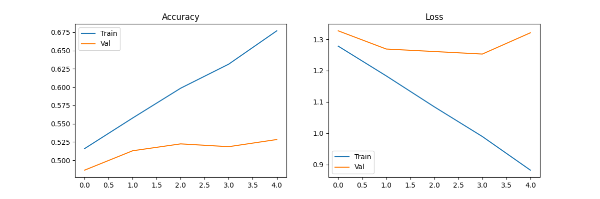
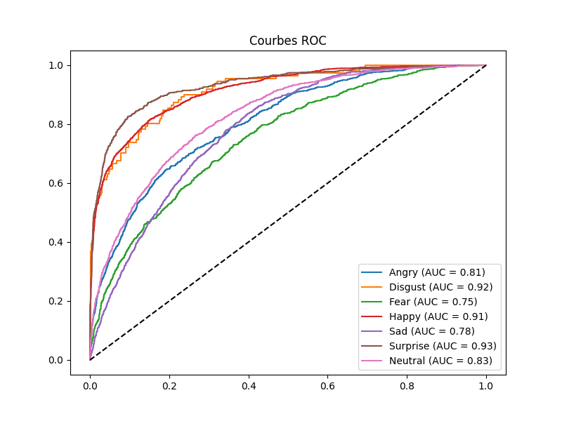
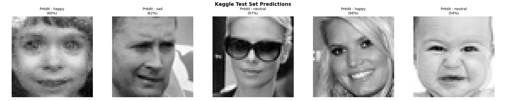
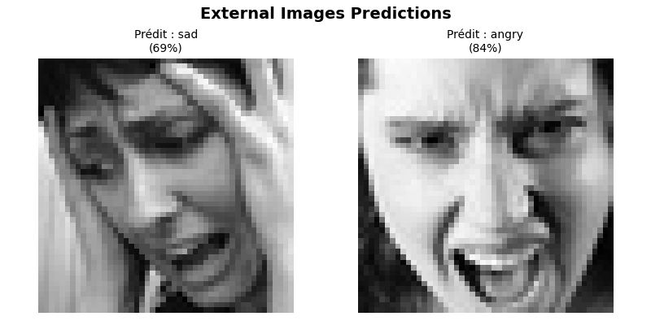

# 🎭 Détection des Émotions par Deep Learning (CNN)

Ce projet implémente un pipeline complet de reconnaissance d'émotions faciales en utilisant un réseau de neurones convolutionnel (CNN) développé avec TensorFlow / Keras. Il intègre également une couche d'interprétabilité avec SHAP et s'inscrit dans une démarche DevOps grâce à un versionning et un suivi rigoureux avec Git.

Le système est entraîné sur le dataset FER-2013 (Kaggle) et classifie les visages selon 7 émotions :

- Angry
- Disgust
- Fear
- Happy
- Sad
- Surprise
- Neutral

---

# 📌 Objectifs Pédagogiques

- Initiation aux réseaux de neurones et CNN
- Traitement d'images et Computer Vision
- Fine-Tuning et optimisation d'hyperparamètres
- Analyse des performances du modèle
- Interprétabilité avec SHAP
- Intégration DevOps avec Git et GitHub

---

# 🛠️ Architecture du Modèle CNN

| Couche | Paramètres | Fonction |
|---|---|---|
| Conv2D | 32/64/128 filtres | Extraction des caractéristiques |
| MaxPooling2D | 2×2 | Réduction de dimension |
| Dropout | 0.3 – 0.5 | Régularisation |
| Flatten | — | Passage vers couches denses |
| Dense | 128 neurones | Classification |
| Softmax | 7 sorties | Prédiction des émotions |

---

# 📈 Résultats du Modèle

## 📊 Métriques d'entraînement



---

## 📉 Courbes ROC



---

## 😊 Prédictions sur le Test Set Kaggle



---

## 🌍 Prédictions sur Images Externes



---

## 🖼️ Image de test 1


---

## 🖼️ Image de test 2


---

# ▶️ Exécution du Projet

```bash
python emotionDetection.py